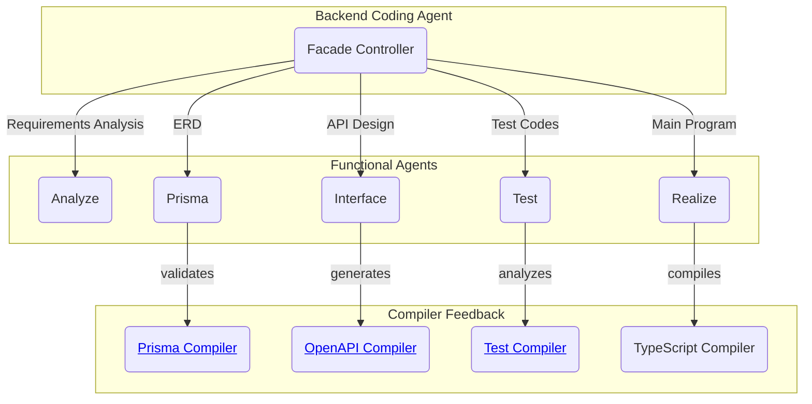
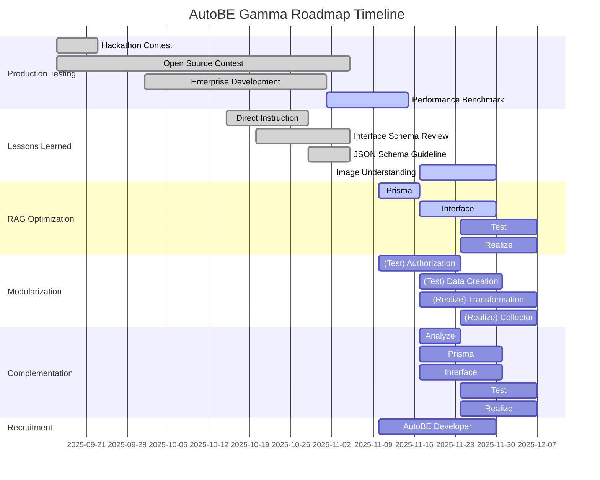

import AutoBeDemoMovie from "../../movies/demo/AutoBeDemoMovie";

# AI backend builder for prototype to production

Describe your backend requirements in natural language through AutoBE's chat interface. 

AutoBE will analyze your requirements and build the backend application for you. The generated backend application is designed to be 100% buildable by AI-friendly compilers and ensures stability through powerful e2e test functions.

With such AutoBE, build your first backend application quickly, then maintain and extend it with AI code assistants like Claude Code for enhanced productivity and stability.

AutoBE will generate complete specifications, detailed database and API documentation, comprehensive test coverage for stability, and clean implementation logic that serves as a learning foundation for juniors while significantly improving senior developer productivity.

Check out these complete backend application examples generated by AutoBE:

<br />
<iframe
  src="https://www.youtube.com/embed/JNreQ0Rk94g"
  title="AutoBE Demonstration (Bulletin Board System)"
  width="100%"
  style={{ aspectRatio: "16/9" }}
  allow="accelerometer; autoplay; clipboard-write; encrypted-media; gyroscope; picture-in-picture; web-share"
  referrerPolicy="strict-origin-when-cross-origin"
  allowFullScreen
/>

1. **To Do List**: [`todo`](https://github.com/wrtnlabs/autobe-examples/tree/main/openai/gpt-4.1/todo)
2. **Discussion Board**: [`bbs`](https://github.com/wrtnlabs/autobe-examples/tree/main/openai/gpt-4.1/bbs)
3. **Reddit Community**: [`reddit](https://github.com/wrtnlabs/autobe-examples/tree/main/openai/gpt-4.1/reddit)
4. **E-Commerce**: [`shopping`](https://github.com/wrtnlabs/autobe-examples/tree/main/openai/gpt-4.1/shopping)
   - Requirements Analysis: [Report](https://github.com/wrtnlabs/autobe-examples/tree/main/openai/gpt-4.1/shopping/docs/analysis)
   - Database Design: [Entity Relationship Diagram](https://github.com/wrtnlabs/autobe-examples/tree/main/openai/gpt-4.1/shopping/docs/ERD.md) / [Prisma Schema](https://github.com/wrtnlabs/autobe-examples/tree/main/openai/gpt-4.1/shopping/prisma/schema)
   - API Design: [API Controllers](https://github.com/wrtnlabs/autobe-examples/tree/main/openai/gpt-4.1/shopping/src/controllers) / [DTO Structures](https://github.com/wrtnlabs/autobe-examples/tree/main/openai/gpt-4.1/shopping/src/api/structures)
   - E2E Test Functions: [`test/features/api`](https://github.com/wrtnlabs/autobe-examples/tree/main/openai/gpt-4.1/shopping/test/features/api)
   - API Implementations: [`src/providers`](https://github.com/wrtnlabs/autobe-examples/tree/main/openai/gpt-4.1/shopping/src/providers)

## Getting Started

[](https://stackblitz.com/github/wrtnlabs/autobe-playground-stackblitz)

https://stackblitz.com/github/wrtnlabs/autobe-playground-stackblitz

Visit the site above to use AutoBE directly through the StackBlitz website. Simply discuss the topic you want to build, and AutoBE will create a backend application for you.

Here's an example conversation script to use with AutoBE. Following this script will guide AutoBE to create an "Economic/Political Discussion Board":

1. **Requirements Analysis**: "I want to create an economic/political discussion board. Since I'm not familiar with programming, please write a requirements analysis report as you see fit."
2. **Database Design**: "Design the database schema."
3. **API Specification**: "Create the API interface specification."
4. **Testing**: "Make the e2e test functions."
5. **Implementation**: "Implement API functions."

If you want to use Local LLMs like `qwen3-80b-a3b` or maintain multiple chat sessions for frequent conversations with AutoBE, run the following commands. You can install AutoBE locally, run the playground application directly, and manage your chat sessions:

```bash
git clone https://github.com/wrtnlabs/autobe
cd autobe
pnpm install
pnpm run playground
```

<br/>
<AutoBeDemoMovie data="openai/gpt-4.1" />

> After installing AutoBE locally and running the playground, you can replay chat sessions from AutoBE development team's testing at http://localhost:5713/replay/index.html.

## How AutoBE Works



AutoBE follows a waterfall methodology to generate backend applications, with 40+ specialized agents handling each phase. The agents work in coordinated teams throughout the development process.

Each waterfall stage includes AI-friendly compilers that guarantee type safety of the generated code. Rather than generating code directly, AutoBE's agents first construct language-neutral Abstract Syntax Trees using predefined schemas. Each AST node undergoes validation against type rules before any code generation occurs, catching structural errors at the conceptual level rather than during compilation.

This approach is designed to ensure that the final generated TypeScript and Prisma code is 100% buildable. Based on our testing with multiple example projects including e-commerce platforms, discussion boards, and task management systems, AutoBE maintains this compilation guarantee across diverse application types.

To illustrate this process, here are the phase outputs from our "Economic/Political Discussion Board" example:

1. **Requirements Analysis**: [Report](https://github.com/wrtnlabs/autobe-example-bbs/tree/main/docs/analysis)
2. **Database Design**: [Entity Relationship Diagram](https://github.com/wrtnlabs/autobe-example-bbs/tree/main/docs/ERD.md) / [Prisma Schema](https://github.com/wrtnlabs/autobe-example-bbs/tree/main/prisma/schema)
3. **API Specification**: [API Controllers](https://github.com/wrtnlabs/autobe-example-bbs/tree/main/src/controllers) / [DTO Structures](https://github.com/wrtnlabs/autobe-example-bbs/tree/main/src/api/structures)
4. **E2E Test Functions**: [`test/features/api`](https://github.com/wrtnlabs/autobe-example-bbs/tree/main/test/features/api)
5. **API Implementations**: [`src/providers`](https://github.com/wrtnlabs/autobe-example-bbs/tree/main/src/providers)

Also, you don't need to use all phases - stop at any stage that fits your needs. Whether you want just requirements analysis, database design, API specification, or e2e testing, AutoBE adapts to your workflow.

Additionally, if you're skipping the full pipeline because of language preference rather than workflow needs, this capability is in development - AutoBE's language-neutral AST structure will soon support additional programming languages beyond TypeScript.

## Type-Safe Client SDK

Every AutoBE-generated backend automatically includes a type-safe client SDK, making frontend integration seamless and error-free. This SDK provides:

- **Zero Configuration**: SDK is auto-generated alongside your backend - no manual setup required
- **100% Type Safety**: Full TypeScript support with autocomplete and compile-time validation
- **Framework Agnostic**: Works with React, Vue, Angular, or any TypeScript/JavaScript project
- **E2E Test Integration**: Powers AI-generated test suites for comprehensive backend testing

```typescript
import api, { IPost } from "autobe-generated-sdk";

// Type-safe API calls with full autocomplete
const connection: api.IConnection = {
  host: "http://localhost:1234",
};
await api.functional.users.login(connection, {
  body: {
    email: "user@example.com",
    password: "secure-password",
  },
});

// TypeScript catches errors at compile time
const post: IPost = await api.functional.posts.create(connection, {
  body: {
    title: "Hello World",
    content: "My first post",
    // authorId: "123" <- TypeScript error if this field is missing!
  },
});
```

This SDK eliminates the traditional pain points of API integration - no more manual type definitions, no more runtime surprises, and no more API documentation lookups. Your frontend developers can focus on building features, not wrestling with API contracts.

**Beyond Frontend Integration**: The SDK powers both frontend development and E2E test generation. AutoBE uses the same type-safe SDK internally to generate comprehensive test suites, ensuring every API endpoint is thoroughly tested. This creates a robust feedback loop that enhances backend stability - AI writes tests using the SDK, the SDK ensures type safety, and your backend becomes more reliable with every generated test.

## Roadmap Schedule



AutoBE has successfully completed both Alpha and Beta development phases, establishing a solid foundation with **100% compilation success rate**. The current **Gamma Release** represents a strategic evolution based on real-world production experience.

**Production Testing Experience**: Through enterprise development, open-source contests, and hackathons, we validated AutoBE in real production environments. This practical experience revealed both strengths and areas for improvement, directly shaping our development priorities.

**Strategic Shift**: While earlier phases pursued perfection for each feature, Gamma adopts a breadth-first approach - rapidly building foundational prototypes across more features, with quality refinement following through team expansion and incremental improvement.

**Key Focus Areas**:

- **RAG Optimization**: Transitioning from batch processing to intelligent iterative workflows, where agents selectively request only necessary information, achieving up to 70% token reduction
- **Modularization**: Generating reusable, maintainable code modules instead of duplicated implementations, making AI-generated code developer-friendly
- **Complementation**: Enabling incremental updates to generated backends instead of full regeneration, supporting iterative improvement workflows
- **Multimodal Support**: Extracting requirements from visual artifacts like Figma designs and ERD diagrams, not just natural language
- **Direct Instruction**: Allowing precise technical specifications for database schemas and API designs when business constraints require it

This roadmap prioritizes practical developer experience over theoretical perfection, informed by months of real-world usage in enterprise environments.

## Current Limitations

While AutoBE achieves 100% compilation success, please note these current limitations:

**Runtime Behavior**: Generated applications compile successfully, but runtime behavior may require testing and refinement. Unexpected runtime errors can occur during server execution, such as database connection issues, API endpoint failures, or business logic exceptions that weren't caught during compilation. We strongly recommend thorough testing in development environments before deploying to production. Our v1.0 release targets 100% runtime success to address these issues.

**Design Interpretation**: AutoBE's database and API designs may differ from your expectations. We recommend thoroughly reviewing generated specifications before proceeding with implementation, especially before production deployment.

**Token Consumption**: AutoBE requires significant AI token usage for complex projects. Based on our testing, projects typically consume 30M-250M+ tokens depending on complexity (simple todo apps use ~4M tokens, while complex e-commerce platforms may require 250M+ tokens). We are working on RAG optimization to reduce this overhead in future releases.

**Maintenance**: AutoBE focuses on initial generation and does not provide ongoing maintenance capabilities. Once your backend is generated, you'll need to handle bug fixes, feature additions, performance optimizations, and security updates manually. We recommend establishing a development workflow that combines the generated codebase with AI coding assistants like Claude Code for efficient ongoing development and maintenance tasks.


## License

AutoBE is licensed under the [GNU Affero General Public License v3.0 (AGPL-3.0)](https://github.com/wrtnlabs/autobe/?tab=AGPL-3.0-1-ov-file#readme). If you modify AutoBE itself or offer it as a network service, you must make your source code available under the same license.

However, backend applications generated by AutoBE can be relicensed under any license you choose, such as MIT. This means you can freely use AutoBE-generated code in commercial projects without open source obligations, similar to how other code generation tools work.
