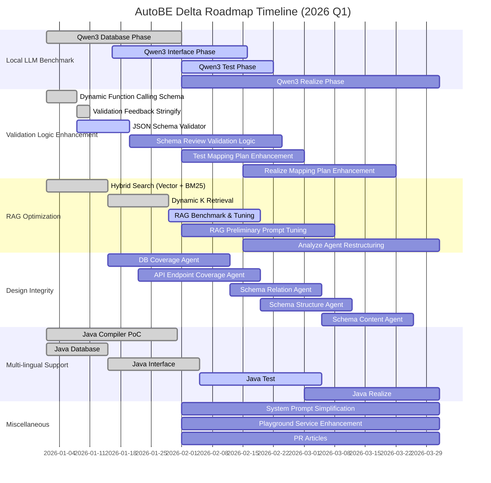

## Preface

import AutoBeDemoMovie from "../../../movies/demo/AutoBeDemoMovie";



The AutoBE Delta roadmap pivots from the **horizontal expansion** of Gamma to **vertical refinement**.

During the Gamma roadmap, we operated under a "ship fast, iterate later" philosophy, rapidly implementing features such as RAG, Modularization, and Complementation. By prioritizing breadth over polish, AutoBE evolved into a platform spanning the entire backend generation domain—but left stability gaps scattered throughout the system.

Delta fills these gaps. We leverage Local LLM benchmarks to unearth logic flaws and missing validations that commercial models gracefully masked, then systematically address them. We also complete the Hybrid Search architecture by adding **Vector Similarity search** to the RAG introduced in Gamma, and formally launch **Multi-lingual Support** (Java/Kotlin).

## 1. Local LLM Benchmark

<br />

<AutoBeDemoMovie model="qwen/qwen3-next-80b-a3b-instruct" />

Commercial models like Claude Sonnet and GPT are remarkably capable. Even when system prompts are somewhat ambiguous or validation feedback logic has blind spots, these models rarely trigger those edge cases. For developers, this means defects remain hidden—everything appears to work, so we assume nothing is broken.

Running the same workflows on open-source models such as `qwen3-next-80b-a3b` or `qwen3-30b-a3b-thinking` tells a different story. Workflows that never failed on commercial models falter repeatedly on Qwen3. The model references non-existent database tables, uses reserved keywords as DTO property names, and embeds `description` or entirely fictitious spec data inside JSON Schema `properties`.

This is the core strategy of Delta: **Use Qwen3 as the crucible to surface hidden defects, then fix them to ensure even more robust operation on commercial models.** We benchmark each Phase—Database, Interface, Test, and Realize—analyze failure causes, and iterate on improvements. Once a Phase achieves 100% success rate, we advance to the next, then analyze and improve again. This simple yet relentless cycle forms the backbone of Delta.

## 2. Validation Logic Enhancement

Before prompts come schemas and logic—and they must be bulletproof. Edge cases invisible on commercial models surface on Qwen3, revealing design oversights. We harden schemas and validation logic toward flawlessness, continuously improving as benchmarks uncover new edge cases.

### 2.1. Dynamic Function Calling Schema

The **Preliminary Asset** feature introduced in Gamma enables subsequent Phases to access artifacts from earlier Phases. For instance, when designing DTOs in the Interface Phase, calling `getDatabaseTable(name: string)` retrieves the table schema designed in the Database Phase. Similarly, the Test Phase calls `getInterfaceOperation(endpoint: string)` to fetch API endpoint information.

The problem is that these functions' parameter types are statically declared as `string`. Even when the system prompt explicitly states "do not request non-existent endpoints" and validation feedback returns errors, Qwen3 stubbornly ignores these instructions.

To address this, we construct **dynamic function calling schemas** for preliminary asset functions. By constraining requestable table names and endpoints to `enum` unions, we block access to non-existent database tables or API operations at the schema level itself.

```typescript
// Before: Static schema
interface IAutoBePreliminaryGetDatabaseSchemas {
  type: "getDatabaseSchemas";
  schemaNames: string[] & tags.MinItems<1>;
}

// After: Dynamic schema
interface IAutoBePreliminaryGetDatabaseSchemas {
  type: "getDatabaseSchemas";
  schemaNames: Array<
    | "shopping_customers"
    | "shopping_sales"
    | "shopping_sale_snapshots"
    | "shopping_sale_snapshot_units"
    | ...
  > & tags.MinItems<1>;
}
```

### 2.2. JSON Schema Validator

When designing DTOs in the Interface Phase, Qwen3 commits an impressive variety of JSON Schema errors—from simple constraint violations to structural defects:

- Placing Object type metadata (`description`, `AutoBeOpenApi.IJsonSchema.IObject["x-autobe-database-schema"]`) inside `properties`
- Specifying `AutoBeOpenApi.IJsonSchema.IObject["x-autobe-database-schema"]` on non-Object types
- Constructing contradictory JSON schema constraints (e.g., `minimum > maximum`)
- Inconsistent casing in DTO type/property names and use of system reserved words
- Non-compliance with UUID type requirements for `id` and `*_id` properties

Additional edge cases continue to emerge through benchmarking. We add validators for these errors to prevent malformed schemas from propagating to subsequent Phases.

### 2.3. Validation Feedback Stringify

Previously, when runtime validation failed, we fed the `IValidation.IFailure` value returned by `typia.validate<T>()` directly to the agent. However, this structure contains only mechanical error information, and Qwen3 often failed to understand exactly what went wrong.

We developed a **custom JSON stringify function** that annotates validation errors as comments. By appending `// ERROR: ...` with specific error reasons next to problematic properties, the agent can intuitively identify what needs fixing and how.

### 2.4. Schema Review Validation Logic

The Schema Relation/Structure/Content Agents covered in the Design Integrity section are core agents ensuring DTO quality. For these agents to function properly, **robust validation logic** must come first. We systematically build validation logic to eliminate issues exposed in Qwen3 benchmarks—skipped property reviews, nonsensical review results, and modification instructions not reflected in the actual schema.

**Complete Traversal Verification**:
- Verify that the agent's review output includes every type and property
- Return an error if even a single type or property is missing
- Confirm that the `path` field in review results matches actual schema paths

**Modification Instruction Consistency Verification**:
- Validate required fields by modification type (`add`/`modify` require `property`)
- Confirm the location pointed to by `path` exists in the actual schema (for `delete`, `modify`)
- For `add`, verify no existing property exists at the same path
- Pre-validate potential circular references

**Agent-Specific Validation**:
- **Relation Agent**: Bidirectional consistency of FK relationships, existence of referenced types
- **Structure Agent**: 1:1 correspondence between DB columns and DTO properties, type compatibility matrix
- **Content Agent**: Non-empty verification for description/example fields, type appropriateness of example values

This validation logic must be implemented before the Schema Agents operate and applies commonly to all three agents in the Design Integrity section.

### 2.5. Test Mapping Plan Enhancement

The **Modularization** introduced in Gamma divides large projects into multiple modules, generating code independently for each. The Test Phase's Mapping Plan defines which test files cover which API endpoints, along with execution order and dependencies between tests. On Qwen3, the following issues occurred frequently:

- Specifying non-existent endpoints as test targets
- Duplicate test assignments for the same endpoint
- Circular dependencies between tests (A→B→C→A)
- Attempting to execute successor tests without their predecessors

**Validation Enhancements**:
- Endpoint existence verification
- Duplicate assignment detection
- Dependency DAG verification (cycle detection)
- Dependency order verification (topological sort feasibility)

**Dynamic Enum Schema Application**:
- Change the endpoint field in Mapping Plans from `string` to an `enum` union of actually existing endpoints
- Also constrain test filename fields with dynamic enums to prevent typos and references to non-existent files

### 2.6. Realize Mapping Plan Enhancement

The Realize Phase's Mapping Plan defines which Provider implements which API endpoint and the call relationships between Providers. It has a more complex dependency structure than the Test Phase, with the following additional issues:

- Omissions in N:M mappings between Providers and endpoints
- Duplicate generation of common utility functions
- Circular calls between Providers
- DB transaction boundary mismatches

**Validation Enhancements**:
- Complete endpoint coverage verification
- Provider dependency DAG verification
- Common utility duplication detection
- DB access pattern consistency verification

**Hierarchical Mapping Plan Structure**:
- Redesign the existing flat Mapping Plan into a **hierarchical structure**
- Define clear ownership through a 3-tier hierarchy: `Module → Provider → Endpoint`
- Perform validation independently at each tier for easier error source identification

**Explicit Provider Dependency Declaration**:
- When a Provider calls another Provider, force explicit declaration in the Mapping Plan
- Treat undeclared Provider calls as compilation errors
- This prevents runtime errors from implicit dependencies

**Progressive Validation Pipeline**:
1. **Syntactic Validation**: Grammatical correctness of Mapping Plan structure
2. **Semantic Validation**: Endpoint/Provider existence, type matching
3. **Dependency Validation**: DAG verification, cycle detection
4. **Coverage Validation**: Confirmation that all endpoints are implemented

Each stage must pass before proceeding to the next; on failure, provide detailed error messages specific to that stage.

## 3. RAG Optimization

The RAG (Retrieval-Augmented Generation) introduced in Gamma had a monolithic structure where agents received all input materials at once. As project scale grew, token consumption increased exponentially, and context included information the agent didn't actually need—creating inefficiency.

In Delta, we transition to a structure where agents **actively request only the information they need**. We add functions like `analyzeFiles()`, `getDatabaseSchemas()`, `getInterfaceOperations()`, and `getInterfaceSchemas()` to each workflow agent's function calling schema, enabling agents to acquire necessary assets based on their own judgment. The target is a **70% reduction in token consumption**.

### 3.1. Hybrid Search (Vector + BM25)

The existing BM25-based keyword search relies on exact keyword matching, making it difficult to capture synonyms or similar concepts. When searching for "payment system," results like "payment processing" or "purchase handling" might be missed.

In Delta, we add **Vector Similarity search** to establish a Hybrid Search architecture. We embed each section of requirements documents using OpenAI's `text-embedding-3-small` model and calculate cosine similarity with queries. By weighted aggregation of BM25 and Vector scores, we can compute final rankings that consider both keyword matches and semantic relevance.

```
final_score = α × BM25_score + (1 - α) × vector_similarity
```

The optimal α value will be determined through benchmarking, with an initial value of 0.5.

### 3.2. Dynamic K Retrieval

Fixing the K value in Top-K search creates two problems. If K is too small, relevant documents are missed; if too large, unnecessary documents are included, wasting tokens. Depending on the query, the actually relevant documents might number 3 or 30.

In Delta, we analyze the **score distribution (sharpness)** of search results to dynamically adjust K. We detect the point where scores drop sharply (elbow point) and return results only up to that point.

- **Sharpness threshold**: Raised from 0.2 to 0.5 (based on benchmarking)
- **K range**: kMin=5, kMax=150

This loads only the appropriate amount of context for each query's characteristics, reducing token costs while maintaining recall.

### 3.3. RAG Benchmark & Tuning

We build a benchmark framework for quantitative evaluation of RAG system performance. We construct 14 test cases with clear correct answers and verify whether intended documents are retrieved as Top-1.

Benchmark items:
- **Retrieval Accuracy**: Whether intended documents are included in Top-K
- **Token Efficiency**: Token consumption comparison before and after RAG implementation
- **Tool Calling Count**: Function calling count measurements for todo, bbs, and shopping projects

In particular, we continuously strengthen validation feedback logic and system prompts to resolve the "infinite re-request of already-acquired assets" issue that occurred on open-source models (Qwen3).

### 3.4. RAG Preliminary Prompt Tuning

The key to the RAG system is for agents to **request appropriate assets at the right moment**. However, current agents rarely call the `getAnalysisFiles()` function that queries requirements documents. They readily request DB schemas and API specs, yet neglect to reference the requirements documents that justify those designs.

The root cause lies in the RAG preliminary agent's system prompt. We only instructed agents to "request when needed" without providing concrete guidance on **when to reference requirements**.

**Prompt Optimization Directions**:
- Explicitly enumerate situations where requirements reference is mandatory
- Provide specific trigger conditions for `getAnalysisFiles()` calls
- Warn about potential problems from not referencing requirements
- Contrast good vs. poor requirements utilization examples

**Dual Index File Structure**:
For large requirements documents, loading everything at once exceeds token limits. To solve this, we apply a dual structure of **[Index file] + [RAG top-k files]**. The index file contains the table of contents, section titles, and 1-2 sentence summaries of each section. The agent first reads the index file to grasp the overall structure, then selectively requests only the detailed sections needed for the current task. This enables efficient information exploration where the agent "sees the forest, then picks the trees."

We review and optimize prompts comprehensively across not just the RAG preliminary agent, but all agents that utilize requirements (Database, Interface, Test, Realize).

### 3.5. Analyze Agent Restructuring

The Analyze Phase is the first step in transforming user requirements into structured form. Currently it merely organizes input documents, but with RAG optimization, **fundamental redesign** is needed.

**Current Problems**:
- Requirements documents are RAG-searched and loaded at **file granularity**, causing significant size variation between files
- Core feature pages span thousands of tokens while auxiliary feature pages span hundreds, causing ranking imbalance
- File boundaries don't align with logical units
- Chunk division criteria should be determined at the Analyze stage but currently aren't considered
- Cross-references and dependency information between requirements are missing

**Chunk Granularization Strategy**:
- Divide chunks by **topic** or **section** rather than file
- Hierarchical division based on heading levels (H1, H2, H3)
- Set appropriate token count range per chunk (e.g., 500-2000 tokens)
- Overlap between chunks to ensure contextual continuity

**Search Method Improvements**:
- Automatically include parent context (parent sections) after chunk-level search
- Simultaneous loading of related documents through chunk clustering
- Utilize chunk metadata (source file, section path, token count)

**Analyze Agent Redesign Directions**:
- **Automatic hierarchy analysis** of requirements documents and chunk boundary determination
- **Automatic summary generation** for each chunk (for index files)
- Build **cross-reference graphs** between requirements
- Automatic assignment of **semantic tags** for use in subsequent Phases

We clearly define and integrate the interface between these two systems so that Analyze Agent output can directly serve as RAG system input.

## 4. Design Integrity

In backend systems, DB design and Interface design must be tightly coupled. Tables defined in the DB should be appropriately exposed through APIs, data referenced by APIs must exist in the DB, and DB column types must be consistent with DTO property types. When this design consistency breaks, it can lead to runtime errors, data loss, and security vulnerabilities.

In Gamma, each Phase operated independently, lacking this cross-validation. In Delta, we introduce the concept of **Design Integrity**, building mechanisms to verify and guarantee inter-Phase design consistency.

### 4.1. DB Coverage Agent

We develop an agent that verifies **coverage** of DB table design against requirements documents. It analyzes requirements documents to extract mentioned entities, attributes, and relationships, then confirms whether these are reflected in the actual DB schema.

Verification items:
- **Entity Coverage**: Are all concepts specified in requirements modeled as tables?
- **Attribute Coverage**: Are each entity's attributes defined as columns?
- **Relationship Coverage**: Are inter-entity relationships (1:1, 1:N, M:N) implemented as FKs and junction tables?

When omissions are detected, the agent proposes supplementary tables/columns, which are reflected in Database Phase artifacts after user approval.

### 4.2. API Endpoint Coverage Agent

We develop an agent that verifies API endpoint coverage against requirements and DB design. It confirms whether appropriate CRUD endpoints exist for tables defined in the DB and whether business logic specified in requirements is exposed through APIs.

Verification items:
- **Base CRUD Coverage**: Existence of basic CRUD (Create, Read, Update, Delete) endpoints for each table
- **Action Endpoint Coverage**: Existence of endpoints for special actions specified in requirements (e.g., "cancel order," "approve payment")
- **Query Endpoint Coverage**: Existence of endpoints for list retrieval, search, filtering, and other query functions

We provide an interactive review process enabling addition, modification, and deletion of existing endpoints.

### 4.3. Schema Relation Agent

In Gamma, four review agents operated sequentially to ensure DTO quality:

1. **Relation Review Agent**: FK relationships, referential integrity verification
2. **Security Review Agent**: Security vulnerabilities, authentication boundary verification
3. **Content Review Agent**: Field completeness, type appropriateness verification
4. **Phantom Review Agent**: Removal of properties not existing in actual DB

On commercial models, these agents generally functioned properly. However, Qwen3 benchmarks revealed serious problems. Agents frequently skipped reviewing certain properties, produced nonsensical review results, or failed to properly reflect modification instructions in actual schemas.

In Delta, we reorganize these into three agents (Relation, Structure, Content) and **extremely strengthen function calling schemas and validation logic**. The goal is **super-schema + logic hardening** that leaves no room for error.

The previous approach regenerated entire JSON Schemas as review results, but this consumed many tokens and risked unintended changes. In Delta, all three agents transition to outputting **AST structures containing targeted modification instructions for individual properties**:

```typescript
interface ISchemaModification {
  type: "add" | "delete" | "modify";
  path: string;           // e.g., "IShoppingSale.seller_id"
  property?: IProperty;   // for add/modify
  reason: string;         // modification reason
}
```

Additionally, all three agents are **forced to completely traverse all properties**. The agent must review each type and property one by one and explicitly output the review result (modification needed/not needed). The validator checks for review omissions and returns an error if even a single property is skipped. This eliminates Qwen3's tendency to skip certain properties.

**Schema Relation Agent** verifies and corrects **reference relationships** between DTOs:

- **FK Relation Integrity**: Verify that DB FK relationships are correctly reflected in DTOs
- **Reference Type Consistency**: Confirm correctness of reference types (e.g., `IShoppingSale.seller: IShoppingSeller`)
- **Aggregation/Composition**: Verify that 1:N, M:N relationships are appropriately expressed as array types
- **Circular Reference Prevention**: Prevent infinite loops from circular references

### 4.4. Schema Structure Agent

**Schema Structure Agent** verifies and corrects the **structural consistency** of DTOs. It particularly uses consistency with DB schema as the core criterion:

- **DB Existence Check**: Confirm DTO properties correspond to actual DB columns; issue deletion instructions if not (Phantom functionality integrated)
- **Type Consistency**: Verify compatibility between DB types and DTO types; modify to match DB on inconsistency
- **Nullable Consistency**: Adjust DTO optional/required based on DB `NOT NULL` constraints
- **Security Boundary**: Verify sensitive information (actor_id, actor_session_id, etc.) is not exposed in Write DTOs (Security functionality integrated)

Like the Relation Agent, complete traversal of all properties is enforced, and errors are returned on review omissions. When inconsistencies are detected, **DTOs are modified based on the DB schema**. The DB is the source of truth.

### 4.5. Schema Content Agent

**Schema Content Agent** does not change DTO structure; it only supplements **metadata (descriptions, examples, comments)**. Like the Relation and Structure Agents, it outputs **AST structures containing targeted modification instructions** rather than regenerating entire JSON Schemas:

```typescript
interface IContentModification {
  path: string;                    // e.g., "IShoppingSale.customer_id"
  description?: string;            // type/property description
  example?: unknown;               // example value
  deprecated?: string;             // deprecation notice
}
```

Review items:

- **Type Description**: Write clear descriptions of what each DTO type represents
- **Property Description**: Document each property's meaning, purpose, and constraints
- **Example Values**: Provide representative example values (OpenAPI's `example` field)
- **Deprecation Notice**: Guidance for properties scheduled for deprecation

Like other agents, **complete traversal of all types and properties** is enforced. The validator checks for review omissions and returns errors if any property lacks a description or example.

By separating Relation, Structure, and Content Agents, each agent's role becomes clear, they can work independently, and review completeness can be individually guaranteed for each.

## 5. Multi-lingual Support

AutoBE currently generates TypeScript/NestJS-based backend code. However, demand for the Java/Spring ecosystem remains substantial in the enterprise market. In Delta, we formally launch architectural restructuring for multi-lingual support and Java Compiler development.

Each Phase of AutoBE has different code generation structures, so Java support strategies also vary by Phase. Some Phases already use language-neutral AST (Abstract Syntax Tree) and can be addressed by adding code generators, while others have TypeScript-specific structures requiring fundamental architectural restructuring.

| Phase | Current Structure | Java Support Strategy |
|-------|------------------|----------------------|
| **Database** | Agent generates AST | Develop Java code generator |
| **Interface** | Agent generates AST | Develop Java code generator |
| **Test** | Agent writes TypeScript as text | TS → AST conversion Agent → Java code gen |
| **Realize** | No AST structure | Language-neutral AST design required |

### 5.1. Java Compiler PoC

We conducted a Java Compiler PoC by the first week of January 2026. We attempted Java code generation for each of the Database, Interface, and Test Phases to identify potential challenges in actual implementation.

Key challenges derived from the PoC:
- **Database**: Define mapping rules between Prisma schema and Hibernate Entity
- **Interface**: Define conversion rules from OpenAPI spec to Spring Controller/DTO
- **Test**: Analyze TypeScript test code structure and examine AST conversion feasibility

This identified focus areas for each Phase and refined the overall implementation roadmap.

### 5.2. Java Database

In the Database Phase, agents generate [`AutoBeDatabase.IApplication`](https://github.com/wrtnlabs/autobe/blob/main/packages/interface/src/database/AutoBeDatabase.ts) AST through function calling. This AST represents all DB schema information—tables, columns, relationships, indexes—in a language-neutral manner.

The Java code generator takes this AST as input and generates:
- **Hibernate Entity classes**: Java classes with JPA annotations like `@Entity`, `@Table`, `@Column`
- **Repository interfaces**: Interfaces extending Spring Data JPA's `JpaRepository`
- **Relationship mappings**: Relationship annotations like `@OneToMany`, `@ManyToOne`, `@ManyToMany`

Conceptual differences exist between Prisma's relation syntax and Hibernate's relationship mappings, requiring accurate conversion logic. Particular care is needed for implicit many-to-many relationships, cascade options, and fetch strategies.

### 5.3. Java Interface

In the Interface Phase, agents also generate [`AutoBeOpenApi.IDocument`](https://github.com/wrtnlabs/autobe/blob/main/packages/interface/src/openapi/AutoBeOpenApi.ts) AST. This AST represents API endpoints, request/response schemas, and authentication information based on the OpenAPI 3.1 spec.

The Java code generator takes this AST as input and generates:
- **Spring Controllers**: Controller classes with `@RestController`, `@RequestMapping`, `@GetMapping`, etc.
- **DTO classes**: Java records or classes representing Request/Response bodies
- **Swagger documentation**: SpringDoc annotations like `@Operation`, `@ApiResponse`, `@Schema`

The key challenge is mapping between OpenAPI's JSON Schema and Java's type system, particularly handling `oneOf`, `anyOf`, and `nullable`. Additionally, we must consider correspondence between NestJS's decorator-based validation and Spring's Bean Validation (`@Valid`, `@NotNull`, etc.).

### 5.4. Java Test

The Test Phase has agents directly writing TypeScript code as text. Without a language-neutral AST, an intermediate conversion stage is needed for Java support.

The [`AutoBeTest`](https://github.com/wrtnlabs/autobe/blob/main/packages/interface/src/test/AutoBeTest.ts) structure exists as a remnant of past AST mode attempts. However, this structure also contains TypeScript-specific representations, limiting its direct use as Java code generator input. Therefore, we employ a multi-stage strategy:

1. **TypeScript code generation**: Agent writes TypeScript e2e test code as text
2. **AST conversion Agent**: Separate conversion agent parses TypeScript code into `AutoBeTest` structure
3. **Language neutralization**: Refine TypeScript-specific expressions in `AutoBeTest` to language-neutral form
4. **Java code generator**: Generate JUnit 5-based test code from the refined AST

The language neutralization in stage 3 requires various experiments:

- Convert TypeScript's `async/await` patterns to Java synchronous calls or CompletableFuture
- Convert arrow function callbacks to Java lambdas or anonymous classes
- Convert type assertions to Java casting
- Address test framework differences (vitest → JUnit 5, expect → AssertJ)

This process may require restructuring the `AutoBeTest` structure itself, potentially designing a more language-neutral test representation system.

### 5.5. Java Realize

The Realize Phase is the most challenging area. Currently no AST structure exists; agents directly write TypeScript Provider code as text. Provider code implements actual business logic, defining API endpoint behavior.

For Java support, we must design a **new language-neutral AST**. This AST must be capable of expressing the following programming concepts:

- **Control flow**: if/else, switch, for/while, try/catch
- **Data manipulation**: Variable declaration, assignment, operations
- **Function calls**: Method invocation, chaining, callbacks
- **Object manipulation**: Property access, instance creation

The challenge is TypeScript-specific syntax:
- **Object Literal**: Instant object creation in `{ key: value }` form
- **Undefined/Null handling**: The `undefined` keyword, optional chaining (`?.`), nullish coalescing (`??`)
- **Spread Operator**: Object/array spreading in `...obj` form
- **Destructuring**: Destructuring assignment in `const { a, b } = obj` form

We must design a **universal AST** that excludes these TypeScript-specific constructs and develop a code generator that converts this to Java code. The goal within three months is a **draft-level design**, with actual implementation and verification proceeding in subsequent roadmaps.

## 6. Miscellaneous

### 6.1. System Prompt Simplification

AutoBE's system prompts are structured using **Meta Prompting**. We provide agents with functions to call and their type definitions, where JSDoc comments on functions and interface types serve as documentation.

The problem is that we had AI generate explanations of these comments to create system prompts. The result is excessively verbose prompts with redundant expressions that sometimes miss the point. This leads to unnecessary token consumption and uncertain prompt quality.

In Delta, we fundamentally review system prompts:

- **Remove redundant expressions**: Consolidate sections explaining the same concept multiple times
- **Clarify core directives**: Concisely organize rules agents must follow
- **Improve token efficiency**: Remove unnecessary modifiers and explanations to reduce token consumption
- **Ensure consistency**: Unify writing style and structure across Phase-specific system prompts

### 6.2. Playground Service Enhancement

AutoBE provides a locally-runnable Playground service. However, the current version implements only minimal functionality with an inadequate user experience.

In Delta, we enhance the Playground to the level of the service developed during a past hackathon:

- **SQLite-based history storage**: Permanently preserve backend applications and conversation histories in local SQLite DB
- **Project management**: Management capabilities to create, view, and delete multiple backend projects
- **Conversation history viewing**: View conversation records with agents for each project in timeline format
- **Artifact download**: Batch download of generated code, schemas, and documentation

This enables users to systematically preserve and manage backend applications created through AutoBE.

### 6.3. PR Articles

We will conduct promotional activities to introduce AutoBE to the developer community. We will continuously post technical articles on major developer communities including dev.to, Reddit, and Hacker News.

Planned topics:

- **AutoBE Introduction**: Concepts and operating principles of the AI-powered automatic backend generation platform
- **Deep Technical Analysis**: Core technology explanations including RAG, Multi-Phase Architecture, and Design Integrity
- **Use Cases**: Tutorials for generating actual backends with AutoBE
- **Benchmark Results**: Performance comparison analysis between commercial and open-source models

We will continuously write articles throughout the quarter to raise AutoBE awareness and collect community feedback.
