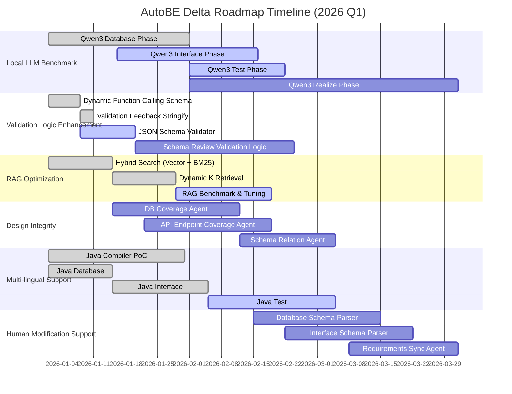

```mermaid
gantt
  dateFormat YYYY-MM-DD
  title AutoBE Delta Roadmap Timeline (2026 Q1)

  section Local LLM Benchmark
  Qwen3 Database Phase             : done,    2026-01-01, 31d
  Qwen3 Interface Phase            : active,  2026-01-16, 31d
  Qwen3 Test Phase                 : active,  2026-02-01, 21d
  Qwen3 Realize Phase              : planned, 2026-02-01, 59d

  section Validation Logic Enhancement
  Dynamic Function Calling Schema  : done,    2026-01-01, 7d
  Validation Feedback Stringify    : done,    2026-01-08, 3d
  JSON Schema Validator            : active,  2026-01-08, 12d
  Schema Review Validation Logic   : planned, 2026-01-20, 35d

  section RAG Optimization
  Hybrid Search (Vector + BM25)    : done,    2026-01-01, 14d
  Dynamic K Retrieval              : done,    2026-01-15, 14d
  RAG Benchmark & Tuning           : active,  2026-01-29, 21d

  section Design Integrity
  DB Coverage Agent                : planned, 2026-01-15, 28d
  API Endpoint Coverage Agent      : planned, 2026-01-22, 28d
  Schema Relation Agent            : planned, 2026-02-12, 21d

  section Multi-lingual Support
  Java Compiler PoC                : done,    2026-01-01, 30d
  Java Database                    : done,    2026-01-01, 14d
  Java Interface                   : done,    2026-01-15, 21d
  Java Test                        : active,  2026-02-05, 28d

  section Human Modification Support
  Database Schema Parser           : planned, 2026-02-15, 28d
  Interface Schema Parser          : planned, 2026-02-22, 28d
  Requirements Sync Agent          : planned, 2026-03-08, 24d
```