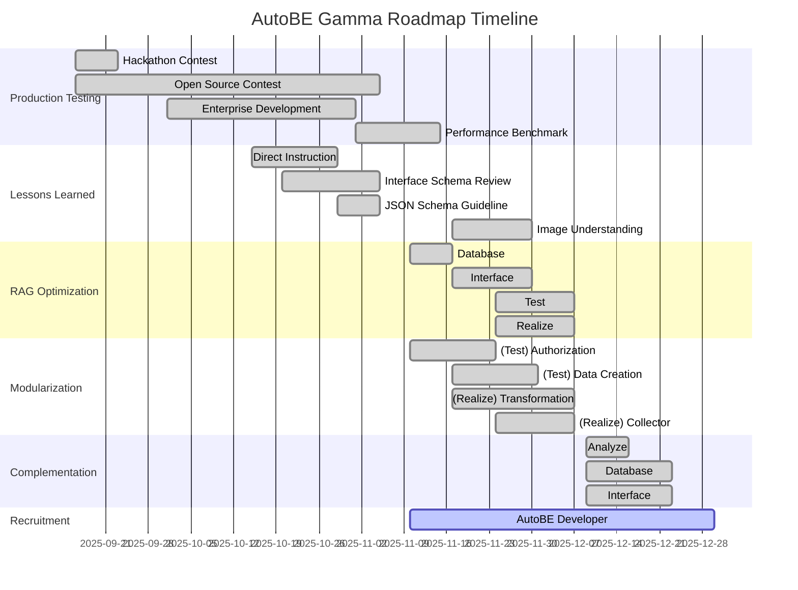

```mermaid
gantt
  dateFormat YYYY-MM-DD
  title AutoBE Gamma Roadmap Timeline

  section Production Testing
  Hackathon Contest     : done, 2025-09-16,  7d
  Open Source Contest   : done, 2025-09-16, 50d
  Enterprise Development: done, 2025-10-01, 31d
  Performance Benchmark : done, 2025-11-01, 14d
  
  section Lessons Learned
  Direct Instruction     : done, 2025-10-15, 14d
  Interface Schema Review: done, 2025-10-20, 16d
  JSON Schema Guideline  : done, 2025-10-29,  7d
  Image Understanding    : done, 2025-11-17, 13d

  section RAG Optimization
  Database : done, 2025-11-10,  7d
  Interface: done, 2025-11-17, 13d
  Test     : done, 2025-11-24, 13d
  Realize  : done, 2025-11-24, 13d

  section Modularization
  (Test) Authorization    : done, 2025-11-10, 14d
  (Test) Data Creation    : done, 2025-11-17, 14d
  (Realize) Transformation: done, 2025-11-17, 20d
  (Realize) Collector     : done, 2025-11-24, 13d

  section Complementation
  Analyze  : done, 2025-12-09,  7d
  Database : done, 2025-12-09, 14d
  Interface: done, 2025-12-09, 14d

  section Recruitment
  AutoBE Developer: active, 2025-11-10, 50d
```