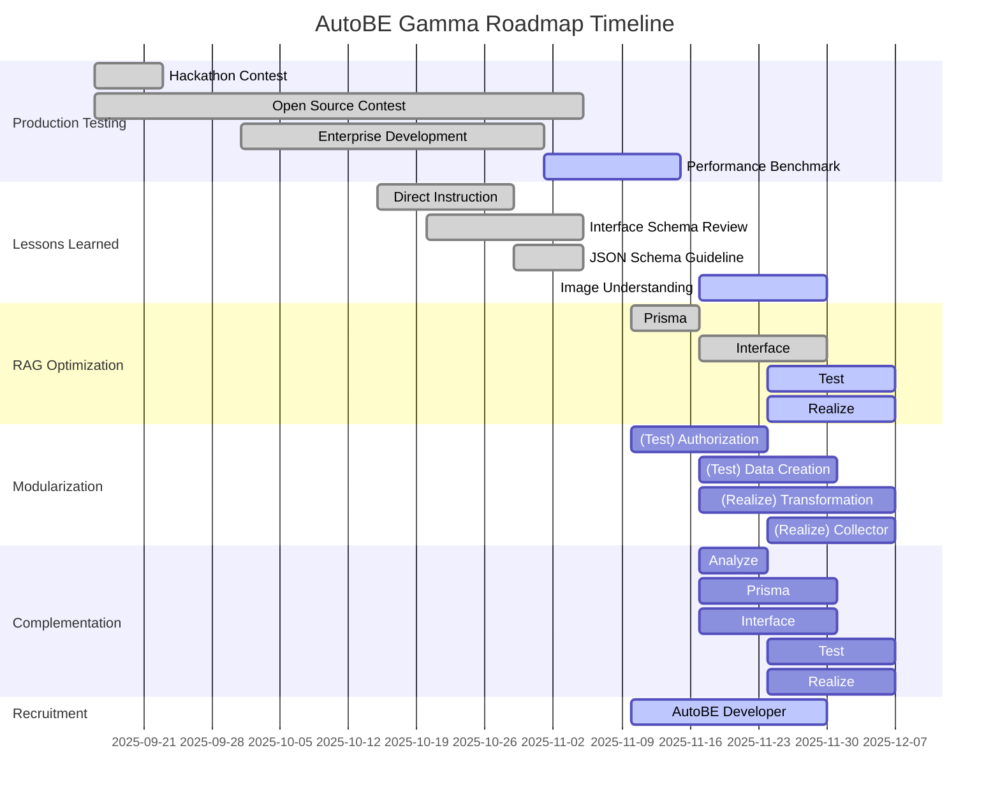

```mermaid
gantt
  dateFormat YYYY-MM-DD
  title AutoBE Gamma Roadmap Timeline

  section Production Testing
  Hackathon Contest     : done  , 2025-09-16,  7d
  Open Source Contest   : done  , 2025-09-16, 50d
  Enterprise Development: done  , 2025-10-01, 31d
  Performance Benchmark : active, 2025-11-01, 14d
  
  section Lessons Learned
  Direct Instruction     : done  , 2025-10-15, 14d
  Interface Schema Review: done  , 2025-10-20, 16d
  JSON Schema Guideline  : done  , 2025-10-29,  7d
  Image Understanding    : active, 2025-11-17, 13d

  section RAG Optimization
  Prisma   : done,   2025-11-10,  7d
  Interface: done,   2025-11-17, 13d
  Test     : active, 2025-11-24, 13d
  Realize  : active, 2025-11-24, 13d

  section Modularization
  (Test) Authorization    : planned, 2025-11-10, 14d
  (Test) Data Creation    : planned, 2025-11-17, 14d
  (Realize) Transformation: planned, 2025-11-17, 20d
  (Realize) Collector     : planned, 2025-11-24, 13d

  section Complementation
  Analyze  : planned, 2025-11-17,  7d
  Prisma   : planned, 2025-11-17, 14d
  Interface: planned, 2025-11-17, 14d
  Test     : planned, 2025-11-24, 13d
  Realize  : planned, 2025-11-24, 13d

  section Recruitment
  AutoBE Developer: active, 2025-11-10, 20d
```